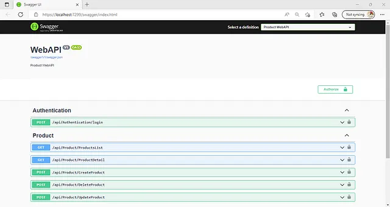
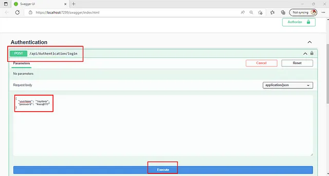
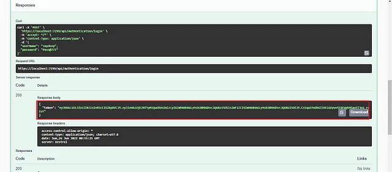
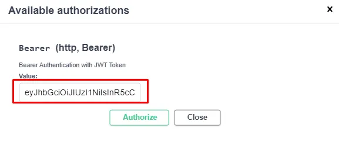
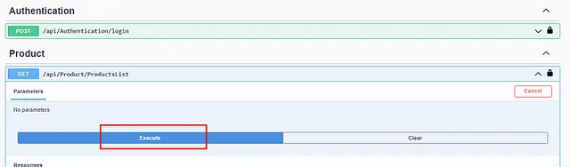
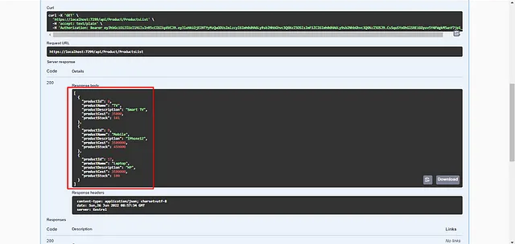

## JWT Token Authentication Using the .NET Core Web API

### Quick setup

```javascript
Download package or open with Visual Studio
Check dependencies with NuGet  
Run program.cs
Navigate to <Host>/Swagger/ 
```
Create the token after providing credentials, and put it into the Authorize tab inside Swagger UI, as shown in the below image  







