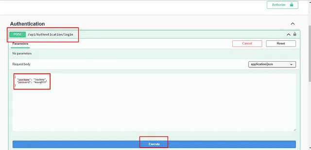

## JWT Token Authentication Using the .NET Core Web API

A complete Web API application with Microsoft Entity Framework Core, Redis Cache and JWT Authentication.

### Quick setup

Download package or open with Visual Studio  
Check dependencies with NuGet  
Configure Authentication controller for login credentials and appsettings.json, ensure Redis server is running in Linux or WSL for windows  
Execute the following command in the Package Manager Console for the entity framework data migration and database updates before running the program  

```javascript
add-migration “First”
update-database
```

### OpenAPI/Swagger UI
Create the token after providing credentials, and put it into the Authorize tab inside Swagger UI, as shown in the below image  





